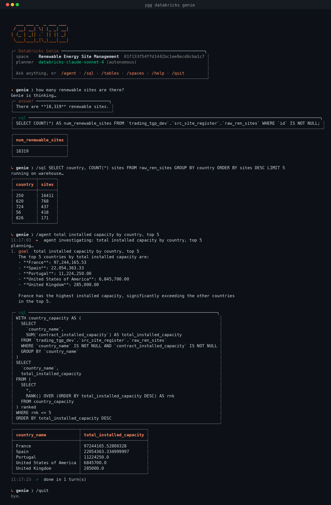

# yggdrasil.databricks.genie

Conversational analytics over Databricks **Genie** — ask questions in
plain English, get back a natural-language answer, the SQL Genie
generated, and the result materialised as Arrow / Polars / pandas. Plus a
self-driving **agent** that turns a single goal into a multi-turn
investigation, and a rich `ygg databricks genie` console.

Reached through the single client entrypoint:

```python
from yggdrasil.databricks import DatabricksClient

genie = DatabricksClient().genie
```



*A live `ygg databricks genie console` session: the banner shows the
active space and the autonomous planner; a Genie ask returns an answer +
SQL + result table; a raw `/sql` runs on the warehouse; and `/agent`
drives a fully-autonomous investigation (the `databricks-claude-sonnet-4`
planner decides each step, Genie executes the SQL).*

## One-liner

```python
from dataclasses import replace
from yggdrasil.databricks import DatabricksClient

client = DatabricksClient()
client.genie.defaults = replace(client.genie.defaults, space_id="01ef…")

answer = client.genie.ask("top 5 customers by revenue this year")
print(answer.text)          # natural-language summary
print(answer.sql)           # the SQL Genie generated
df = answer.to_polars()     # the result as a polars DataFrame
```

## Concepts

| Resource | What it is |
|---|---|
| `Genie` | The service (`client.genie`). Resolves spaces, lists them, one-shot `ask`, builds agents. Carries `GenieDefaults`. |
| `GenieSpace` | A curated Genie room scoped to a set of tables + instructions. Start conversations, ask, list conversations. |
| `GenieConversation` | A live thread. `ask()` posts a follow-up turn and waits. |
| `GenieAnswer` | One message: `.text`, `.sql`, `.questions`, lifecycle state, and the query result (`.to_arrow()` / `.to_polars()` / `.to_pandas()` / `.rows()`). |
| `GenieAgent` / `AgentRun` | The autonomous driver and its transcript. |

## Spaces

A space is the unit you talk to — every question runs against the tables
and instructions curated in that space.

```python
genie = DatabricksClient().genie

# Discover spaces visible to you
for space in genie.list_spaces():
    print(space.space_id, space.title)

# Find one by title (case-insensitive)
space = genie.find_space(title="Renewable Energy Site Management")

# Or address it by id
space = genie.space("01f133f54ffd1442bc1ee8ecd6cba1c7")
print(space.title)          # cached infos — one get_space round-trip
print(space.warehouse_id)   # the warehouse Genie runs queries on
print(space.explore_url)    # deep link into the Databricks UI
```

## Ask a question

`ask()` is the one-shot path — it starts a fresh conversation and returns
just the answer.

```python
answer = space.ask("How many renewable sites are there?")

answer.text          # "There are 967 renewable sites…"
answer.status        # "COMPLETED"
answer.is_complete   # True
answer.failed        # False
answer.has_query     # True — Genie ran a SQL query
answer.sql           # "SELECT COUNT(DISTINCT id) …"
answer.description    # Genie's one-line description of the query
```

When Genie can't answer concretely it offers **suggested follow-up
questions** instead:

```python
answer = space.ask("show me sales")
if not answer.has_query:
    print(answer.questions)   # ("by region?", "by month?", …)
```

## Materialise the result

A query-backed answer carries an inline result. It projects to the
project's usual surfaces, with typed casts applied from the result
manifest (unknown / complex types stay as strings to preserve the bytes):

```python
answer = space.ask("top 3 sites by installed capacity")

answer.to_arrow()    # pyarrow.Table  (or None for a text-only answer)
answer.to_polars()   # polars.DataFrame
answer.to_pandas()   # pandas.DataFrame
answer.rows()        # list[dict] — e.g. [{"name": "...", "capacity": 400000.0}, …]
answer.row_count     # rows reported by the result manifest

# The raw SDK statement response is available too, if you need it
answer.statement_response
```

## Multi-turn conversations

Keep the thread alive to ask follow-ups in context:

```python
conv, first = space.start_conversation("revenue by month")
print(first.to_polars())

nxt = conv.ask("now just for EMEA")          # follow-up in the same thread
print(nxt.sql)

for msg in conv.messages():                   # replay the thread
    print(msg.text)
```

## Feedback

```python
answer.thumbs_up(comment="spot on")
answer.thumbs_down(comment="wrong table")
```

## The autonomous agent

`GenieAgent` turns a single goal into a multi-turn investigation, driven
by one of two brains:

- **Planner brain — fully autonomous.** Give it a `planner` (a Model
  Serving LLM) and the agent asks that LLM what to ask Genie next, given
  the goal and the transcript so far, looping until the LLM says the goal
  is answered. This closes the loop across two Databricks AI services: the
  serving LLM *reasons*, Genie *executes* the SQL, the agent *observes*
  the result.
- **Heuristic brain — no LLM.** With no planner, the agent follows
  Genie's own *suggested questions* until it lands a query-backed answer.

```python
# Fully autonomous: an LLM plans, Genie executes
run = client.genie.agent(
    space_id="01ef…",
    planner="databricks-claude-sonnet-4",   # any chat serving endpoint
).run("why did Q3 revenue dip?")

print(run.summary())     # full transcript of every turn
print(run.text)          # the agent's final word
print(run.sql)           # SQL behind the final data answer
df = run.to_polars()     # the final result as a DataFrame
run.rows()               # … or as rows

# Inspect the path it took
for turn in run.turns:
    tag = "agent" if turn.autonomous else "you"
    print(tag, turn.question)
```

Tunables:

```python
agent = client.genie.agent(
    space_id="01ef…",
    planner=True,             # True → the default endpoint ($YGG_GENIE_PLANNER,
                              #   default "databricks-claude-sonnet-4")
                              # or a str endpoint name, or a callable
                              #   (AgentRun) -> next question | None
    max_turns=6,              # how far it will drive (default 4)
    follow_suggestions=True,  # heuristic mode: stop after the first answer if False
)
run = agent.run("break down churn by plan")
```

A custom planner is any callable that, given the run so far, returns the
next question (or `None` to stop) — handy for deterministic policies or a
different reasoning model:

```python
def planner(run):
    if run.data_answer is not None:
        return None                       # got data → done
    return "show me the breakdown by month"

client.genie.agent(space_id="01ef…", planner=planner).run("revenue trend")
```

`AgentRun` resolves the final answer for you:

- `run.answer` — the last answer in the run.
- `run.data_answer` — the most recent answer that actually ran a query.
- `run.text` / `run.sql` / `run.to_arrow()` / `run.to_polars()` /
  `run.to_pandas()` / `run.rows()` — convenience over `data_answer`.

## Defaults

Set the defaults once on the service and every call inherits them:

```python
from dataclasses import replace

client.genie.defaults = replace(
    client.genie.defaults,
    space_id="01ef…",          # default space for ask() / space() / agent()
    warehouse_id=None,          # override the warehouse used for results
    max_result_rows=5000,       # cap rows pulled into Arrow
)
```

`GenieDefaults` also carries the polling budget (`wait`,
default 20 min / 2 s) used while Genie embeds the question, plans a query,
runs it, and summarises. Override per call: `space.ask("…", wait=60)`.

## CLI — `ygg databricks genie`

A Claude-CLI-style console: a branded logo, a live spinner while Genie
thinks, answers in rounded panels, and results in bordered tables. It
drives the *whole* Databricks surface from one prompt — not just Genie.

```bash
# List spaces
ygg databricks genie spaces

# One-shot ask (space id or $YGG_GENIE_SPACE)
ygg databricks genie ask "How many renewable sites are there?" --space 01f133…

# Autonomous agent (heuristic, or fully autonomous with an LLM planner)
ygg databricks genie agent "top 3 sites by capacity" --space 01f133…
ygg databricks genie agent "explain churn" --space 01f133… \
    --planner databricks-claude-sonnet-4

# Interactive console
ygg databricks genie console --space 01f133…
YGG_GENIE_SPACE=01f133… ygg databricks genie console
```

Inside the interactive console:

| Input | Action |
|---|---|
| `<text>` | ask Genie in the current conversation |
| `/agent <goal>` | run the autonomous agent (LLM planner + Genie) |
| `/sql <query>` | run raw SQL on the warehouse, rendered as a table |
| `/tables [c.s]` | `SHOW TABLES` in a schema |
| `/catalogs` | `SHOW CATALOGS` |
| `/warehouses` | list SQL warehouses |
| `/spaces` · `/use <#\|id>` | list and switch Genie spaces |
| `/new` · `/help` · `/quit` | reset · help · leave |

The planner LLM defaults to `$YGG_GENIE_PLANNER`
(`databricks-claude-sonnet-4`); the space to `$YGG_GENIE_SPACE`. The
command accepts the shared Databricks client flags (`--host` / `--token`
/ `--profile` / …) and falls back to the standard `DATABRICKS_*`
environment variables.

## API reference

- [`yggdrasil.databricks.genie.service`](../../../reference/yggdrasil/databricks/genie/service.md)
- [`yggdrasil.databricks.genie.resources`](../../../reference/yggdrasil/databricks/genie/resources.md)
- [`yggdrasil.databricks.genie.agent`](../../../reference/yggdrasil/databricks/genie/agent.md)
